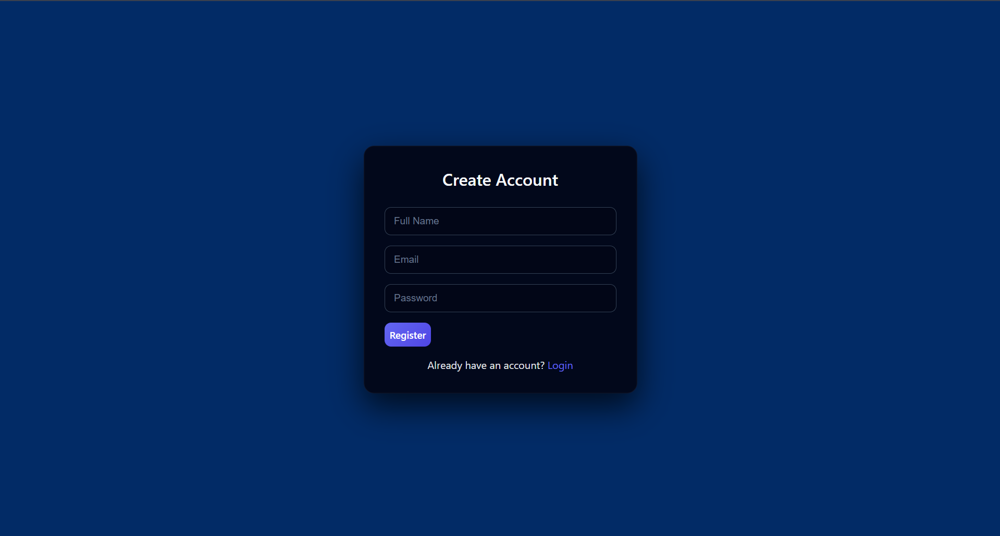
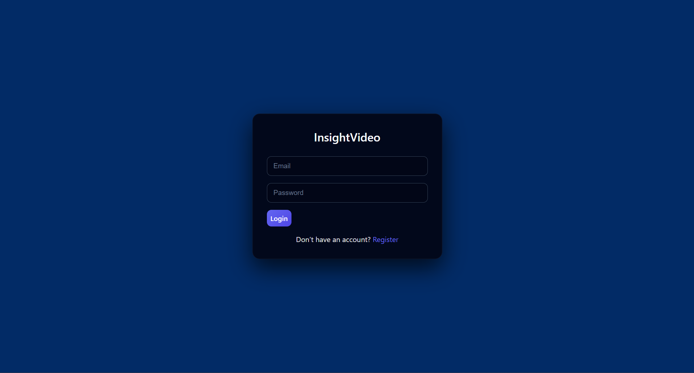
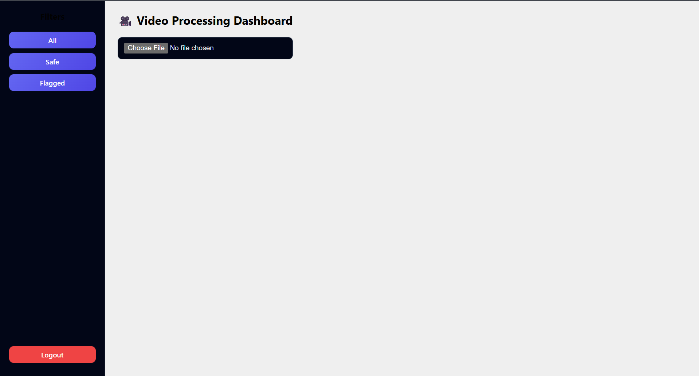
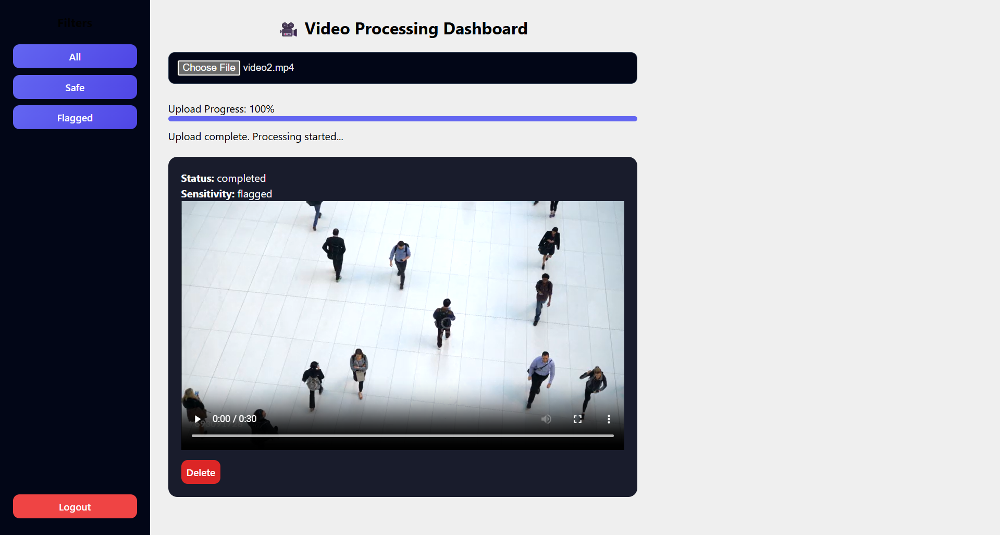

# 🎥 InsightVideo – Video Upload, Sensitivity Processing & Streaming Platform

InsightVideo is a full-stack video processing and streaming application developed as part of the **Pulse Assignment**.  
The platform enables users to upload videos, automatically analyze content sensitivity, receive real-time processing updates, and securely stream videos with role-based access control.

The project is implemented using modern web technologies and follows clean architecture, security best practices, and scalable design principles.

---

## 📌 Assignment Context

**Assignment Title:**  
Video Upload, Sensitivity Processing, and Streaming Application

**Objective:**  
To build a comprehensive full-stack system that supports:
- Secure video upload and storage
- Automated sensitivity analysis
- Real-time processing updates
- HTTP-based video streaming
- Multi-tenant architecture
- Role-based access control

This repository contains the **complete source code**, **local deployment instructions**, and **documentation** for academic evaluation.

---

## 🚀 Key Features

### Core Functionality
- 🔐 Secure user authentication using JWT
- 🧑‍🤝‍🧑 Multi-tenant user isolation
- 🎭 Role-Based Access Control (Viewer / Editor / Admin)
- 📤 Video upload with validation (file type & size)
- ⚙️ Automated sensitivity classification (Safe / Flagged)
- 🔄 Real-time processing updates using Socket.io
- 🎬 Secure video streaming using HTTP Range Requests
- 🗂 Video filtering (All / Safe / Flagged)
- 🗑 Video deletion with permission checks
- 📱 Fully responsive UI (Desktop, Tablet, Mobile)

---

## 🛠️ Technology Stack

### Backend
- **Runtime:** Node.js (LTS)
- **Framework:** Express.js
- **Database:** MongoDB (Mongoose ODM)
- **Authentication:** JWT
- **File Handling:** Multer
- **Real-Time Communication:** Socket.io
- **Video Processing:** FFmpeg
- **Streaming:** HTTP Range Requests

### Frontend
- **Framework:** React (Vite)
- **State Management:** React Hooks & Context
- **Styling:** Custom responsive CSS
- **HTTP Client:** Axios
- **Real-Time:** Socket.io Client

### Database
- **MongoDB Community Server (Local)**

---

## 🏗️ System Architecture

```
Frontend (React + Vite)
        │
        ▼
Backend (Node.js + Express + Socket.io)
        │
        ▼
Local MongoDB (Community Server)
```

---

## 📂 Project Structure

```
InsightVideo/
│
├── backend/
│   ├── src/
│   │   ├── config/          # DB configuration
│   │   ├── controllers/     # Business logic
│   │   ├── middleware/      # Auth & RBAC
│   │   ├── models/          # MongoDB schemas
│   │   ├── routes/          # API routes
│   │   └── server.js        # App entry point
│   │
│   ├── uploads/             # Uploaded video files
│   ├── .env
│   └── package.json
│
├── frontend/
│   ├── src/
│   │   ├── pages/           # Login, Register, Dashboard
│   │   ├── components/      # Upload, VideoCard, Sidebar
│   │   ├── styles/          # Global & responsive CSS
│   │   └── App.jsx
│   │
│   └── package.json
│
└── README.md
```

---

## ⚙️ Local Setup & Execution (Academic Demo)

This project is demonstrated using a **local development environment**, which is fully acceptable for academic review and evaluation.

### 🔧 Prerequisites
- Node.js (LTS)
- MongoDB Community Server
- Git
- VS Code (recommended)

---

### ▶ Backend Setup

```bash
cd backend
npm install
```

Create a `.env` file in the backend directory:

```env
PORT=5000
MONGO_URI=mongodb://127.0.0.1:27017/insightvideo
JWT_SECRET=insightvideo_secret
```

Start backend server:

```bash
npm run dev
```

Expected output:

```
🚀 Backend running on port 5000
✅ MongoDB Connected
```

### ▶ Frontend Setup

```bash
cd frontend
npm install
npm run dev
```

Open in browser:

```
http://localhost:5173
```

---

## 🎥 Workflow Demonstration

### User Registration
- New user creates an account
- Password stored securely (hashed)

### User Login
- JWT token issued
- Role decoded on frontend

### Dashboard Access
- Role-based UI rendering
- Sidebar navigation

### Video Upload
- File validation
- Stored locally
- Upload progress shown

### Processing Phase
- Sensitivity analysis
- Real-time status updates via Socket.io

### Content Review
- Safe / Flagged status display
- Video Streaming

### Secure Playback
- Secure playback using HTTP range requests

### Management Tools
- Filter videos
- Delete videos (Editor/Admin only)

### Logout
- JWT cleared
- Secure session termination

---

## 🎬 Screenshots








---


## 🚫 Deployment Note (Important)

For academic evaluation:

- The application is demonstrated locally
- MongoDB is used in local mode to avoid cloud dependency
- The system architecture is cloud-ready and can be deployed using Vercel, Render, and MongoDB Atlas if required in the future.

---

## 🧪 Challenges Faced & Solutions

### 1. MongoDB Connection Errors

**Issue:** ECONNREFUSED

**Solution:** Ensured MongoDB service was running locally and corrected URI

### 2. Real-Time Update Sync Issues

**Issue:** UI not updating after processing

**Solution:** Proper Socket.io event handling and cleanup

### 3. Video Streaming Issues

**Issue:** Video not playing initially

**Solution:** Implemented HTTP Range Requests correctly

### 4. Responsive UI Issues

**Issue:** Login/Register centering problems

**Solution:** Grid-based fixed auth layout for consistency across devices

---

## 🔮 Future Enhancements

- Cloud deployment with CDN
- Advanced AI-based sensitivity detection
- Video compression and adaptive streaming
- Admin analytics dashboard

---

## 🎓 Academic Declaration

This project was developed as part of a Pulse assignment and demonstrates full-stack development skills, real-time systems, secure authentication, and scalable architecture following professional standards.

---

## 🏁 Conclusion

InsightVideo successfully fulfills all the functional and technical requirements of the assignment, providing a robust, secure, and user-friendly video processing and streaming platform suitable for academic evaluation and future production deployment.

---

**Made with ❤️ for Pulse Assignment**

